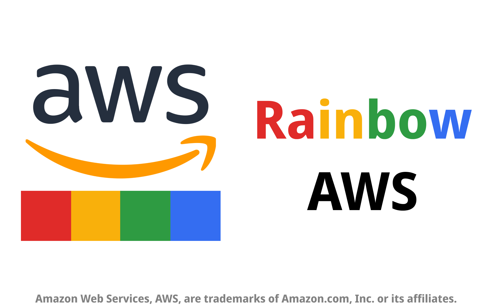

# Rainbow AWS: AWS console header color
Change the color of the AWS console's headers based on the region you select.

## Link
* [Chrome Web Store](https://chrome.google.com/webstore/detail/rainbow-aws-aws-console-h/foicngnfgjoobicakmgedfomghgdkljg) 
* [Github](https://github.com/hahahumble/Rainbow-AWS)

## Feature
* 🔥 Support the latest AWS console UI
* 🌈 Easy to use popup menu to quickly change the color
* 🎨 Use the palette to quickly choose the color you need

## Notice
* ❗️This extension required the "storage" privilege to store the color you choose. It won't collect, read or transmit any data of any kind.

## Build Your Own

### `yarn build`

Builds the app for production to the `build` folder. 
It correctly bundles React in production mode and optimizes the build for the best performance.

The build is minified and the filenames include the hashes. 
Your app is ready to be deployed!

See the section about [deployment](https://facebook.github.io/create-react-app/docs/deployment) for more information.
